# Zsh PATH modification

The primary source of truth for PATH configuration is [zsh/common/zsh_env](../common/zsh_env), which runs for all shell types.

> **Performance note**: `zsh_env` contains **no subprocess calls** (`eval "$(X init ...)"` etc.). Only static variable assignments and path array mutations run here, keeping non-interactive shell startup near-instant. Lazy shell integrations live in [zsh/common/zsh_env_interactive](../common/zsh_env_interactive).

## Base PATH (all shells)

Set in [zsh/common/zsh_env](../common/zsh_env):

1. `~/bin2` - Highest priority user binaries
2. `~/.local/bin` - Local user binaries
3. `~/dotfiles/bin` - Dotfiles utility scripts
4. `/opt/local/{bin,sbin}` - Optional local packages
5. `/usr/local/{bin,sbin}` - System-wide local packages
6. `/usr/{bin,sbin}` - System binaries
7. Existing `$path` - Preserved existing paths

## Conditional Additions (all shells)

Source: [zsh/common/zsh_env](../common/zsh_env). Each tool is added if its expected directory exists.

| Tool | PATH Addition | How binaries are available | Condition |
|------|--------------|---------------------------|-----------|
| Pyenv | `$PYENV_ROOT/bin` + `$PYENV_ROOT/shims` | Shims pre-generated on disk | `~/.pyenv` exists |
| jenv | `~/.jenv/bin` + `~/.jenv/shims` | Shims pre-generated on disk | `~/.jenv` exists |
| Maven | `~/bin2/maven/bin` | Direct binary | Always |
| Golang (goenv) | `$GOENV_ROOT/bin` + `$GOENV_ROOT/shims`, `$GOPATH/bin` | Shims pre-generated on disk | goenv exists |
| Golang (system) | `/usr/local/go/bin`, `$GOPATH/bin` | Direct binaries | system go exists |
| Golang (custom) | `~/bin2/go/bin`, `$GOPATH/bin` | Direct binaries | custom go exists |
| Swift | `/opt/swift/usr/bin` | Direct binary | Linux + `/opt/swift` exists |
| NVM | `NVM_DIR` exported only | Via `_nvm_load_once` precmd | `~/.nvm` exists |
| Cargo/Rust | `~/.cargo/bin` | Direct binaries | `~/.cargo/bin` exists |
| Krew | `$KREW_ROOT/bin` (default: `~/.krew/bin`) | Direct binaries | krew dir exists |
| Wasmer | PATH modified by `wasmer.sh` | wasmer init | wasmer installed |
| Wasmtime | `$WASMTIME_HOME/bin` | Direct binary | `~/.wasmtime` exists |
| Deno | `$DENO_INSTALL/bin` | Direct binary | `~/.deno` exists |
| Serverless | `~/.serverless/bin` | Direct binary | serverless bin exists |
| PNPM | `$PNPM_HOME` | Direct binaries | `~/.local/share/pnpm` exists |
| Bun | `$BUN_INSTALL/bin` | Direct binary | `~/.bun` exists |
| TFEnv | `~/.tfenv/bin` | Direct binary | Always |
| RVM (user) | `~/.rvm/bin` | Via `_rvm_load_once` precmd | `~/.rvm` exists |
| RVM (system) | - | Via `_rvm_load_once` precmd | `/usr/local/rvm` exists |
| poof | `$POOF_ROOT/bin` | Direct binary | Always |

## Lazy Shell Integrations (interactive shells)

Source: [zsh/common/zsh_env_interactive](../common/zsh_env_interactive).

These are `eval "$(X init ...)"` calls that set up shell functions, completions, and hooks for version managers. They are deferred to avoid subprocess cost at startup.

### Shim-based managers - lazy CLI integration only

For pyenv, jenv, and goenv, binaries are already available via shims in PATH (see table above). The lazy stub below loads the *shell integration* (virtualenv hooks, completions, shell function override) on the first explicit call to the manager CLI.

| Manager | Lazy trigger | What fires |
|---------|-------------|-----------|
| `pyenv` | First call to `pyenv` | `eval "$(pyenv init -)"` + `eval "$(pyenv virtualenv-init -)"` |
| `jenv` | First call to `jenv` | `eval "$(jenv init -)"` |
| `goenv` | First call to `goenv` | `eval "$(goenv init -)"` |

### PATH-manipulation managers - precmd one-shot hook

nvm and rvm have no shims directory, they modify PATH directly when sourced. They are loaded by a one-shot `precmd` hook that fires once before the first prompt is drawn, then removes itself. This makes all managed binaries available from the first prompt without affecting `time zsh -i -c exit` (no prompt is drawn during the benchmark).

| Manager | Hook | Loads |
|---------|------|-------|
| nvm | `_nvm_load_once` | `nvm.sh` → node, npm, npx, yarn, corepack, … |
| rvm | `_rvm_load_once` | `rvm/scripts/rvm` → ruby, gem, bundle, irb, rake, … |

## Interactive-Only PATH Additions

Added in `zshrc` or `zsh_env_interactive` - only present in interactive shells.

| Tool | Source file | Addition | Condition |
|------|-------------|----------|-----------|
| zplug command plugins (git-cal) | `zshrc` | `$ZPLUG_HOME/bin` | `~/.zplug/bin` exists |
| FZF | `zsh_env_interactive` | PATH modified by `~/.fzf.zsh` | `~/.fzf.zsh` exists |
| Zoxide | `zsh_env_interactive` | Init hook | zoxide installed |
| Fasd | `zsh_env_interactive` | Init hook (legacy fallback) | fasd installed |
| Direnv | `zsh_env_interactive` | Init hook | direnv installed |
| OpenCode | `zsh_env_interactive` | `~/.opencode/bin` | `~/.opencode/bin` exists |

## Fpath Modifications (completion paths)

Source: [zsh/zprezto/runcoms/zshrc](../zprezto/runcoms/zshrc)

Custom fpath entries are added **before** `source prezto/init.zsh` so that prezto's `completion` module picks them up during its single `compinit` call.

| Path | Condition |
|------|-----------|
| `~/dotfiles/zsh/completions` | Always (if directory exists) |
| `~/dotfiles/zsh/autoloaded` | Always |
| `~/.zsh_user_themes` | `CUSTOM_THEMES_ENABLED=1` only |

## PATH Build-Up Diagram

```mermaid
flowchart TD
    Start([Shell Starts]) --> BaseInit["Initialize Base PATH Array\nzsh_env"]

    BaseInit --> BasePaths["Priority paths:\n1. ~/bin2\n2. ~/.local/bin\n3. ~/dotfiles/bin\n4. /opt/local/bin,sbin\n5. /usr/local/bin,sbin\n6. /usr/bin,sbin\n7. existing $path"]

    BasePaths --> Pyenv{pyenv exists?\n~/.pyenv}

    Pyenv -->|Yes| PyenvAdd["Add $PYENV_ROOT/bin\n+ $PYENV_ROOT/shims\n(static, no subprocess)"]
    Pyenv -->|No| Jenv
    PyenvAdd --> Jenv

    Jenv{jenv exists?\n~/.jenv} -->|Yes| JenvAdd["Add ~/.jenv/bin\n+ ~/.jenv/shims\n(static, no subprocess)"]
    Jenv -->|No| Maven
    JenvAdd --> Maven

    Maven["Add ~/bin2/maven/bin"] --> Golang

    Golang{Golang?} -->|goenv exists| GoenvPath["Add $GOENV_ROOT/bin\n+ $GOENV_ROOT/shims\n+ $GOPATH/bin\n(static, no subprocess)"]
    Golang -->|system go exists| SystemGoPath["Add /usr/local/go/bin\nAdd $GOPATH/bin"]
    Golang -->|custom go| CustomGoPath["Add ~/bin2/go/bin\nAdd $GOPATH/bin"]
    GoenvPath --> Swift
    SystemGoPath --> Swift
    CustomGoPath --> Swift

    Swift{Swift exists?\nLinux + /opt/swift} -->|Yes| SwiftAdd["Add /opt/swift/usr/bin"]
    Swift -->|No| NVM
    SwiftAdd --> NVM

    NVM{NVM exists?\n~/.nvm} -->|Yes| NVMAdd["Export NVM_DIR only\nnvm.sh loaded via precmd\n_nvm_load_once hook"]
    NVM -->|No| Cargo
    NVMAdd --> Cargo

    Cargo{Cargo exists?\n~/.cargo} -->|Yes| CargoAdd["Add ~/.cargo/bin"]
    Cargo -->|No| Krew
    CargoAdd --> Krew

    Krew{Krew exists?} -->|Yes| KrewAdd["Add $KREW_ROOT/bin"]
    Krew -->|No| Wasmer
    KrewAdd --> Wasmer

    Wasmer{Wasmer exists?} -->|Yes| WasmerAdd["Source wasmer.sh"]
    Wasmer -->|No| Wasmtime
    WasmerAdd --> Wasmtime

    Wasmtime{Wasmtime exists?\n~/.wasmtime} -->|Yes| WasmtimeAdd["Add $WASMTIME_HOME/bin"]
    Wasmtime -->|No| Deno
    WasmtimeAdd --> Deno

    Deno{Deno exists?\n~/.deno} -->|Yes| DenoAdd["Add $DENO_INSTALL/bin"]
    Deno -->|No| Serverless
    DenoAdd --> Serverless

    Serverless{Serverless exists?} -->|Yes| ServerlessAdd["Add ~/.serverless/bin"]
    Serverless -->|No| PNPM
    ServerlessAdd --> PNPM

    PNPM{PNPM exists?} -->|Yes| PNPMAdd["Add $PNPM_HOME"]
    PNPM -->|No| Bun
    PNPMAdd --> Bun

    Bun{Bun exists?\n~/.bun} -->|Yes| BunAdd["Add $BUN_INSTALL/bin"]
    Bun -->|No| TFEnv
    BunAdd --> TFEnv

    TFEnv["Add ~/.tfenv/bin"] --> RVM

    RVM{RVM exists?} -->|"~/.rvm"| UserRVM["Add ~/.rvm/bin\nfull init via precmd\n_rvm_load_once hook"]
    RVM -->|"system /usr/local/rvm"| SystemRVM["full init via precmd\n_rvm_load_once hook"]
    RVM -->|No| Poof
    UserRVM --> Poof
    SystemRVM --> Poof

    Poof["Add $POOF_ROOT/bin"] --> ShellCheck

    ShellCheck{Interactive\nShell?} -->|No| NonIntEnd([Non-Interactive:\nPATH Complete])
    ShellCheck -->|Yes| Zplug

    Zplug{~/.zplug/bin\nexists?} -->|Yes| ZplugAdd["Add $ZPLUG_HOME/bin\n(git-cal, etc. - immediate)"]
    Zplug -->|No| FZF
    ZplugAdd --> FZF

    FZF{FZF exists?} -->|Yes| FZFAdd["Source ~/.fzf.zsh\nmay modify PATH"]
    FZF -->|No| Zoxide
    FZFAdd --> Zoxide

    Zoxide{zoxide installed?} -->|Yes| ZoxideAdd["Run: zoxide init zsh"]
    Zoxide -->|No| Fasd
    ZoxideAdd --> Fasd

    Fasd{fasd installed?} -->|Yes| FasdAdd["Run: fasd --init auto"]
    Fasd -->|No| Direnv
    FasdAdd --> Direnv

    Direnv{direnv installed?} -->|Yes| DirenvAdd["Run: direnv hook zsh"]
    Direnv -->|No| OpenCode
    DirenvAdd --> OpenCode

    OpenCode{opencode exists?} -->|Yes| OpenCodeAdd["Add ~/.opencode/bin"]
    OpenCode -->|No| PrecmdHooks
    OpenCodeAdd --> PrecmdHooks

    PrecmdHooks["Precmd one-shot hooks registered\n_zplug_load_once (forgit plugin)\n_nvm_load_once\n_rvm_load_once\n_defer_chpwd_startup"] --> IntEnd

    IntEnd([Interactive:\nPATH Complete\nTools available at first prompt])
```

