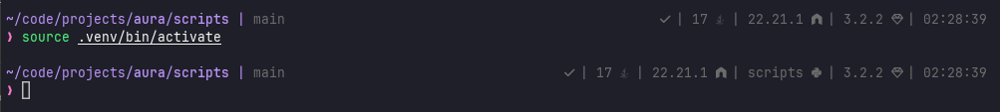
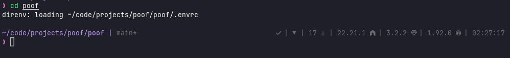
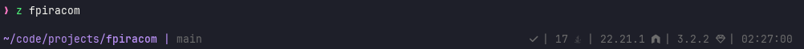
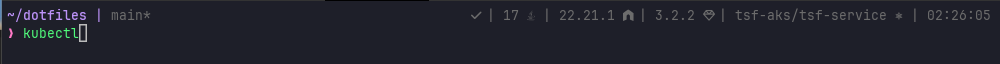
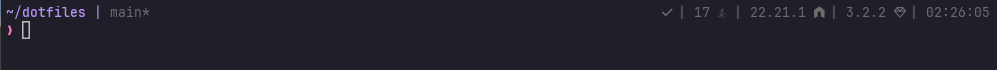

# ZSH Prompt Configuration

This document describes the current prompt configuration using **Powerlevel10k** with Zprezto.

## Preview







## Active Theme

**Powerlevel10k** is the active prompt theme, configured in [zsh/common/p10k.zsh](../common/p10k.zsh) and loaded via [zsh/zprezto/runcoms/zshrc](../zprezto/runcoms/zshrc).

- Custom themes are **disabled** (`CUSTOM_THEMES_ENABLED=0` in zshrc)
- The zpreztorc 'sorin' theme setting is overridden by `prompt powerlevel10k` in zshrc
- Requires a **Nerd Font** (mode: `nerdfont-complete`)

## Left Prompt

The left prompt uses a **2-line layout**:

### Line 1: Directory & Git Status
- **`dir`** - Current directory path
- **`vcs`** - Git repository status

### Line 2: Prompt Character
- **`prompt_char`** - Prompt symbol
  - Normal (magenta): `❯` in insert mode, `❮` in vi command/visual mode
  - Error (red): Same symbols but colored red after failed commands

### Directory Display Behavior

- **Truncation strategy**: `truncate_to_unique` - shows shortest unique prefix
- **Max length**: 80 characters
- **Color**: Blue (#4)
- **Anchors**: Directories containing `.git`, `package.json`, `Cargo.toml`, `go.mod`, etc. are never shortened
- **Writable indicator**: Shows icon for non-writable directories

### Git Status Indicators

- **Color**: Grey (#242)
- **Async updates**: Always enabled (0ms latency threshold)
- **Indicators**:
  - `*` - Dirty (uncommitted changes)
  - `:⇡` - Ahead of remote
  - `:⇣` - Behind remote
  - `@` - Detached HEAD

## Right Prompt

The right prompt displays up to **17 segments** (all on one line), depending on context:

### Always Visible Segments

1. **`time`** - Current time in `HH:MM:SS` format (24-hour)
   - Shows command start time, not end time
   - Updates on each command

2. **`node_version`** - Node.js version
   - Always shown when Node.js is installed
   - Not restricted to project directories (`PROJECT_ONLY=false`)

### Conditionally Visible Segments

3. **`status`** - Exit code of the last command
   - Only shown when the last command failed (non-zero exit code)
   - Displays the actual error code

4. **`command_execution_time`** - Duration of previous command
   - **Threshold**: Only shown if command took **≥5 seconds**
   - Format: `d h m s` (no fractional seconds)
   - Color: Yellow

5. **`background_jobs`** - Presence of background jobs
   - Only shown when background jobs are running
   - Displays count of jobs

6. **`context`** - User and hostname (`user@host`)
   - **Hidden by default** (empty content)
   - Only shown when:
     - Running as root (sudo)
     - Connected via SSH
   - Shows abbreviated hostname

7. **`kubecontext`** - Kubernetes context
   - **Command trigger**: Only shown when typing:
     - `kubectl`
     - `helm`
     - `kubens`
     - `kubectx`
     - `oc` (OpenShift CLI)
   - Hides default context/namespace to reduce clutter
   - Shows cloud cluster name if available

### Programming Language & Environment Segments

8. **`virtualenv`** - Python virtual environment name
   - Only shown when a virtualenv is active
   - Displays environment name

9. **`pyenv`** - Python environment
   - Only shown when pyenv is active and managing Python version

10. **`jenv`** - Java version
    - Always shown when jenv is active (`PROMPT_ALWAYS_SHOW=true`)
    - Not restricted to project directories

11. **`rvm`** - Ruby version
    - **Project-only**: Only shown in Ruby project directories (`VERSION_PROJECT_ONLY=true`)
    - Looks for `Gemfile`, `.ruby-version`, etc.

12. **`goenv`** - Go environment
    - Hidden if version matches global Go version (`PROMPT_ALWAYS_SHOW=false`)
    - Shows when local version differs from global

13. **`rust_version`** - Rust version (rustc)
    - **Project-only**: Only shown in Rust project directories (`VERSION_PROJECT_ONLY=true`)
    - Looks for `Cargo.toml`, `Cargo.lock`, etc.

### Cloud & Infrastructure Segments

14. **`aws`** - AWS profile
    - Only shown when `$AWS_PROFILE` or `$AWS_REGION` is set
    - Displays active profile name

15. **`azcli`** - Azure CLI profile (custom segment)
    - Only shown when `$AZURE_CONFIG_DIR` contains "azcli"
    - Extracts and displays profile name from the directory path
    - **Implementation**: Custom function `prompt_azcli` (lines 465-472 of p10k.zsh)

### Utility Segments

16. **`direnv`** - Direnv status
    - Only shown when direnv is active in the current directory
    - Indicates environment variables are loaded

17. **`nnn`** - nnn shell indicator
    - Only shown when running inside nnn file manager's shell
    - Shows nnn level/context

## Visual Behavior Settings

### Instant Prompt
- **Mode**: `verbose`
- Enables fast prompt initialization
- Shows verbose output during startup if needed

### Transient Prompt
- **Mode**: `same-dir`
- After accepting a command, the prompt is trimmed to save screen space
- Exception: Prompt remains full when entering a new directory (preserves context)

### Prompt Spacing
- **Add newline**: `true`
- Empty line before each prompt (except the first one)
- Improves readability for long sessions

### Hot Reload
- **Disabled** for performance
- Changes to p10k.zsh require a new shell session to take effect

## Segment Ordering Summary

### Left Prompt (2 lines)
```
Line 1: dir vcs
Line 2: prompt_char
```

### Right Prompt (single line, left to right)
```
status command_execution_time background_jobs direnv azcli jenv 
node_version virtualenv pyenv rvm goenv rust_version kubecontext 
aws nnn context time
```

## Configuration File Locations

- **Powerlevel10k config**: [zsh/common/p10k.zsh](../common/p10k.zsh) (symlinked to `~/.p10k.zsh`)
- **ZSH main config**: [zsh/zprezto/runcoms/zshrc](../zprezto/runcoms/zshrc)
- **Zprezto config**: [zsh/zprezto/runcoms/zpreztorc](../zprezto/runcoms/zpreztorc)
- **Environment variables**: [zsh/common/zsh_env_interactive](../common/zsh_env_interactive)

## Module Loading Order

From zpreztorc (lines 32-48), modules load in this sequence:
```
environment → terminal → tmux → editor → history → directory → 
spectrum → utility → ssh → completion → git → syntax-highlighting → 
history-substring-search → contrib-prompt → prompt
```

The `prompt` module loads last and activates Powerlevel10k.

## Environment Variables Affecting Prompt

The following environment variables influence prompt segment visibility and content:

- `$NVM_DIR` - Influences Node.js version detection
- `$PYENV_ROOT` - Influences Python version display
- `$GOENV_ROOT` - Influences Go version display
- `$AZURE_CONFIG_DIR` - Controls azcli segment visibility and content
- `$AWS_PROFILE` / `$AWS_REGION` - Controls AWS segment visibility
- `$KUBECONFIG` - Affects Kubernetes context detection

## Disabled/Commented Segments

The following segments are defined but **not currently active**:

### In Left Prompt
- `context` - User@host (moved to right prompt instead)
- `command_execution_time` - Execution time (moved to right prompt instead)
- `virtualenv` - Python env (moved to right prompt instead)

### In Right Prompt
- `nvm` - Node Version Manager (replaced by `node_version` segment)

## Summary of Visibility Rules

| Segment | Visibility Rule |
|---------|----------------|
| `dir` | Always visible |
| `vcs` | Always visible |
| `prompt_char` | Always visible |
| `time` | Always visible |
| `node_version` | Always visible (when Node.js installed) |
| `status` | Non-zero exit codes only |
| `command_execution_time` | Commands ≥5 seconds only |
| `background_jobs` | When background jobs exist |
| `context` | SSH or root only |
| `kubecontext` | When typing kubectl/helm/kubens/kubectx/oc |
| `virtualenv` | When virtualenv active |
| `pyenv` | When pyenv active |
| `jenv` | Always (when jenv installed) |
| `rvm` | Ruby projects only |
| `goenv` | When version differs from global |
| `rust_version` | Rust projects only |
| `aws` | When AWS_PROFILE/AWS_REGION set |
| `azcli` | When AZURE_CONFIG_DIR contains "azcli" |
| `direnv` | When direnv active |
| `nnn` | Inside nnn shell only |
