# ZSH Shell Initialization with Zprezto

This document explains how ZSH shells initialize with Zprezto, detailing the file loading sequence.

## Shell Startup Order

## Configuration Key Points

- **Non-interactive shells** only execute `zshenv` → `zsh_env`, ensuring scripts have correct PATH
- **Interactive shells** load the full configuration including zprezto framework, completions, and aliases
- **Login shells** additionally source `zprofile` (browser/Rails settings) and `zlogin` (background compilation)
- The file `~/.zprezto/init.zsh` loads these zprezto modules: environment, terminal, tmux, editor, history, directory, spectrum, utility, ssh, completion, git, syntax-highlighting, history-substring-search, contrib-prompt, prompt

## Shell Initialization Flow

Zprezto follows ZSH's standard initialization sequence, but the specific files loaded depend on the shell type:

- **Interactive Login Shell**: Opened when logging in via SSH, TTY, or explicitly (e.g., `zsh -l`)
- **Interactive Non-Login Shell**: Opened in new terminal tabs/windows
- **Non-Interactive Shell**: Scripts, command execution (e.g., `zsh -c "command"`)

```mermaid
flowchart TD
    Start([Shell Starts]) --> ShellType{Shell Type?}

    %% Non-Interactive Path
    ShellType -->|Non-Interactive| NI_zshenv[zshenv]
    NI_zshenv --> NI_zsh_env[zsh_env<br/>Sets PATH for all shells]
    NI_zsh_env --> NI_End([Shell Ready<br/>PATH configured])

    %% Interactive Non-Login Path
    ShellType -->|Interactive<br/>Non-Login| INL_zshenv[zshenv]
    INL_zshenv --> INL_zsh_env[zsh_env<br/>Sets PATH]
    INL_zsh_env --> INL_zshrc[zshrc]
    INL_zshrc --> INL_Steps[zshrc steps...]
    INL_Steps --> INL_End([Shell Ready])

    %% Interactive Login Path
    ShellType -->|Interactive<br/>Login| IL_zshenv[zshenv]
    IL_zshenv --> IL_zsh_env[zsh_env<br/>Sets PATH]
    IL_zsh_env --> IL_zprofile[zprofile<br/>Browser, RAILS_ENV]
    IL_zprofile --> IL_zshrc[zshrc]
    IL_zshrc --> IL_Steps[zshrc steps...]
    IL_Steps --> IL_zlogin[zlogin<br/>Background compilation]
    IL_zlogin --> IL_End([Shell Ready])

    %% zshrc detailed steps
    INL_Steps -.-> ZshrcDetail
    IL_Steps -.-> ZshrcDetail

    subgraph ZshrcDetail[zshrc Initialization Steps]
        direction TB
        S1[1. Initialize zplug<br/>Fix terminal escapes]
        S2[2. Source ~/.zsh_custom_pre<br/>if exists]
        S3[3. Enable P10k instant prompt]
        S4[4. Source ~/.zprezto/init.zsh<br/>Load Zprezto modules]
        S5[5. Load zplug plugins]
        S6[6. Configure prompt P10k]
        S7[7. Set history options]
        S8[8. Load zmv module]
        S9[9. Load bash completions]
        S10[10. Load zsh completions<br/>Run compinit]
        S11[11. Source zsh_env_interactive<br/>Interactive-only PATH]
        S12[12. Source zsh_aliases]
        S13[13. Autoload functions<br/>from ~/dotfiles/zsh/autoloaded]
        S14[14. Source ~/.zsh_custom<br/>if exists]
        S15[15. Source ~/.p10k.zsh<br/>P10k config]
        S16[16. Setup aws_completer]
        S17[17. Source tabtab completions]
        S18[18. Execute zplug load]
        S19[19. Setup terminal quirks fix]
        S20[20. Source chpwd.zsh<br/>Directory change hooks]
        S21[21. Run p10k finalize]

        S1 --> S2 --> S3 --> S4 --> S5 --> S6 --> S7 --> S8 --> S9 --> S10
        S10 --> S11 --> S12 --> S13 --> S14 --> S15 --> S16 --> S17 --> S18
        S18 --> S19 --> S20 --> S21
    end

    style NI_End fill:#e1f5e1
    style INL_End fill:#e1f5e1
    style IL_End fill:#e1f5e1
    style NI_zsh_env fill:#fff4e6
    style INL_zsh_env fill:#fff4e6
    style IL_zsh_env fill:#fff4e6
    style S11 fill:#fff4e6
```

