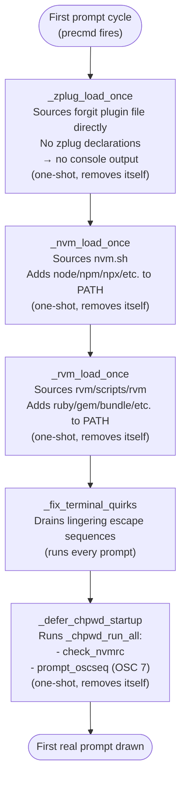

# ZSH Shell Initialization with Zprezto

This document explains how ZSH shells initialize with Zprezto, detailing the file loading sequence.

## Shell Startup Order

## Configuration Key Points

- **Non-interactive shells** only execute `zshenv` → `zsh_env`, ensuring scripts have correct PATH
- **Interactive shells** load the full configuration including zprezto framework, completions, and aliases
- **Login shells** additionally source `zprofile` (browser/Rails settings) and `zlogin` (background compilation)
- The file `~/.zprezto/init.zsh` loads these zprezto modules: environment, terminal, tmux, editor, history, directory, spectrum, utility, ssh, completion, git, syntax-highlighting, history-substring-search, contrib-prompt, prompt
- **`zsh_env` contains no slow subprocess calls** - only static PATH/variable setup. All `eval "$(X init ...)"` calls have been moved to lazy loaders in `zsh_env_interactive`.

## Shell Initialization Flow

Zprezto follows ZSH's standard initialization sequence, but the specific files loaded depend on the shell type:

- **Interactive Login Shell**: Opened when logging in via SSH, TTY, or explicitly (e.g., `zsh -l`)
- **Interactive Non-Login Shell**: Opened in new terminal tabs/windows
- **Non-Interactive Shell**: Scripts, command execution (e.g., `zsh -c "command"`)

```mermaid
flowchart TD
    Start([Shell Starts]) --> ShellType{Shell Type?}

    %% Non-Interactive Path
    ShellType -->|Non-Interactive| NI_zshenv[zshenv]
    NI_zshenv --> NI_zsh_env["zsh_env\nStatic PATH only\n(no eval subprocesses)"]
    NI_zsh_env --> NI_End([Shell Ready\nPATH configured])

    %% Interactive Non-Login Path
    ShellType -->|Interactive\nNon-Login| INL_zshenv[zshenv]
    INL_zshenv --> INL_zsh_env[zsh_env\nStatic PATH]
    INL_zsh_env --> INL_zshrc[zshrc]
    INL_zshrc --> INL_Steps[zshrc steps...]
    INL_Steps --> INL_End([Shell Ready])

    %% Interactive Login Path
    ShellType -->|Interactive\nLogin| IL_zshenv[zshenv]
    IL_zshenv --> IL_zsh_env[zsh_env\nStatic PATH]
    IL_zsh_env --> IL_zprofile[zprofile\nBrowser, RAILS_ENV]
    IL_zprofile --> IL_zshrc[zshrc]
    IL_zshrc --> IL_Steps[zshrc steps...]
    IL_Steps --> IL_zlogin[zlogin\nBackground compilation]
    IL_zlogin --> IL_End([Shell Ready])

    %% zshrc detailed steps
    INL_Steps -.-> ZshrcDetail
    IL_Steps -.-> ZshrcDetail

    subgraph ZshrcDetail[zshrc Initialization Steps]
        direction TB
        S1["1. Fix terminal escape sequences\n(stty drain)"]
        S2["2. Source ~/.zsh_custom_pre if exists\n(machine-specific pre-config)"]
        S3["3. Enable P10k instant prompt\n(shows cached prompt immediately)"]
        S4["4. Add fpath entries BEFORE prezto\n(custom completions dir)"]
        S5["5. Source ~/.zprezto/init.zsh\n(loads modules + single compinit)"]
        S6["6. Set up zplug\n($ZPLUG_HOME/bin → PATH immediately,\n_zplug_load_once precmd for shell plugins,\nlazy zplug CLI stub)"]
        S7["7. Configure prompt powerlevel10k"]
        S8["8. Set history options\n(HISTSIZE, SAVEHIST, HISTFILE)"]
        S9["9. Load bash completions\n(bashcompinit + bash/completions/*)"]
        S10["10. Source zsh_env_interactive\n(lazy env managers + precmd hooks\nfor nvm, rvm)"]
        S11["11. Source zsh_aliases"]
        S12["12. Autoload functions\n(from autoloaded/ - loaded on first call)"]
        S13["13. Source ~/.zsh_custom if exists"]
        S14["14. Source ~/.p10k.zsh"]
        S15["15. Setup aws_completer"]
        S16["16. Source tabtab completions"]
        S17["17. Register _fix_terminal_quirks precmd hook"]
        S18["18. Source chpwd.zsh\nRegister _defer_chpwd_startup precmd hook"]
        S19["19. p10k finalize"]

        S1 --> S2 --> S3 --> S4 --> S5 --> S6 --> S7 --> S8 --> S9 --> S10
        S10 --> S11 --> S12 --> S13 --> S14 --> S15 --> S16 --> S17 --> S18 --> S19
    end
```

## Precmd Hook Chain (First Prompt Only)

After `zshrc` finishes and `p10k finalize` is called, the precmd hooks fire once before the first interactive prompt is drawn. One-shot hooks remove themselves after firing.

After the first prompt, only `_fix_terminal_quirks` remains as a regular precmd hook. `chpwd` fires on directory changes.

## Why the Precmd Pattern?

`time zsh -i -c exit` measures startup by running `exit` immediately - no prompt is ever drawn, so no precmd hook fires. This means nvm, rvm, and zplug plugins add **zero cost** to the benchmark while still being available in every real interactive session.

Output produced during precmd (after `p10k finalize`) does not trigger the Powerlevel10k "console output during initialization" warning. This is why `_defer_chpwd_startup` (which emits an OSC 7 sequence) and `_nvm_load_once` (which may print nvm messages) are safe in precmd.
